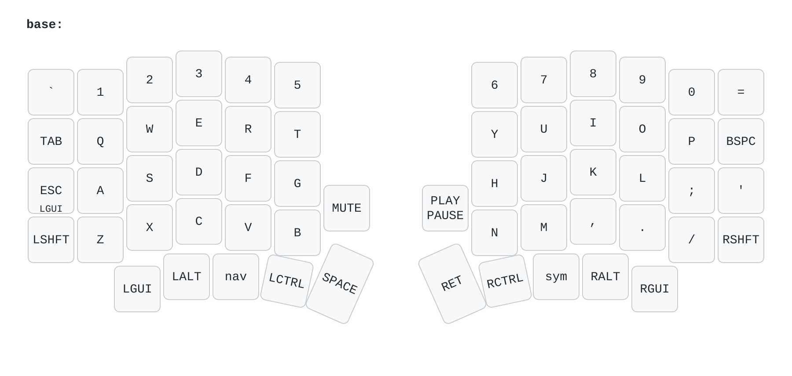
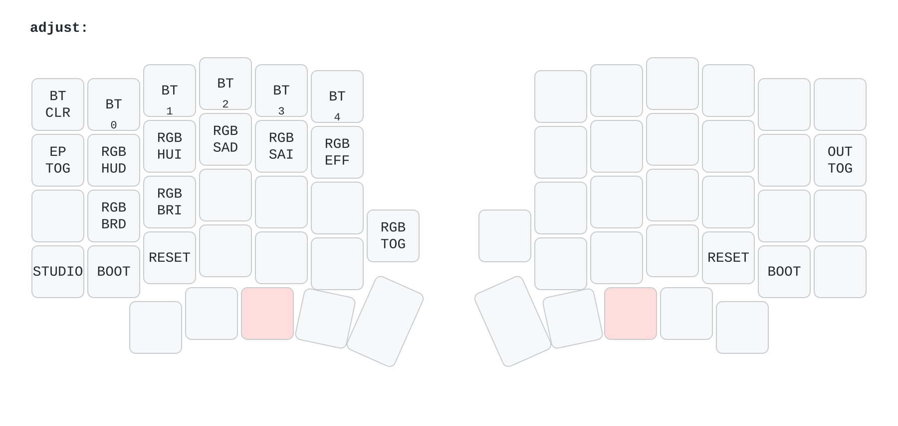

# ZMK-Config: Sofle Choc Pro

Meine Tastaturbelegung fuer die Sofle Choc Pro BT. Gebaut gegen ZMK v0.3.

## Ebenen

Die Basis-Ebene. Der linke Daumen gibt Space, der rechte Enter. Ctrl liegt auf beiden Daumen.



NAV halten: der linke Daumen greift eine Taste nach innen. Die Pfeile liegen dann auf H J K L.


SYM halten: der rechte Daumen greift eine Taste nach innen. Zeichen und F-Tasten links, Zahlen mittig.


ADJUST: beide Daumen greifen nach innen. Bluetooth, RGB und Bootloader.



## Firmware bauen

GitHub Actions baut die Firmware bei jedem Push. Ein lokaler Build ist nicht noetig.

1. Aenderungen committen und pushen.
2. Auf GitHub den Reiter **Actions** oeffnen.
3. Den obersten Lauf anklicken und warten, bis er gruen ist. Das dauert etwa 5 Minuten.
4. Unten unter **Artifacts** die Datei `firmware` herunterladen und entpacken.

Das Archiv enthaelt vier Dateien:

| Datei | Zweck |
|---|---|
| `sofle_choc_pro_left-zmk.uf2` | linke Haelfte, normale Firmware |
| `sofle_choc_pro_right-zmk.uf2` | rechte Haelfte, normale Firmware |
| `settings_reset-sofle_choc_pro_left-zmk.uf2` | linke Haelfte, loescht den Speicher |
| `settings_reset-sofle_choc_pro_right-zmk.uf2` | rechte Haelfte, loescht den Speicher |

## Firmware flashen

Flashe immer eine Haelfte nach der anderen.

> **Achtung:** Spiele nie die `left`-Datei auf die rechte Haelfte. Die Haelften erkennen sich
> danach nicht mehr. Der Fehler laesst sich beheben, kostet aber einen zweiten Durchlauf.

1. Schliesse **eine** Haelfte per USB-C an den Rechner an.
2. Starte den Bootloader. Zwei Wege:
   - Druecke zweimal schnell hintereinander auf den Reset-Knopf der Haelfte.
   - Oder halte beide inneren Daumentasten (NAV + SYM) und druecke `Z` fuer die linke
     Haelfte, `/` fuer die rechte.
3. Ein USB-Laufwerk erscheint im Dateimanager.
4. Kopiere die passende `.uf2`-Datei auf dieses Laufwerk.
5. Das Laufwerk verschwindet von selbst. Die Haelfte startet neu. Das ist das Zeichen fuer Erfolg.
6. Ziehe das Kabel ab. Wiederhole Schritt 1 bis 5 mit der anderen Haelfte.

Beide Haelften verbinden sich danach von selbst wieder.

Zum Schluss die Tastatur mit dem Rechner koppeln: Halte NAV + SYM und druecke eine der Tasten
`1` bis `5`. Jede Taste ist ein Bluetooth-Profil. `` ` `` loescht das aktive Profil.
NAV + SYM + `Backspace` schaltet zwischen USB und Bluetooth um.

## Wenn die neue Belegung nicht erscheint

Diese Config aktiviert ZMK Studio (`CONFIG_ZMK_STUDIO=y` in `build.yaml`). Studio speichert
Belegungen im Flash-Speicher. Diese gespeicherte Belegung hat Vorrang vor der kompilierten.
Eine neu geflashte Keymap bleibt dann unsichtbar.

So loescht du den Speicher:

1. Flashe `settings_reset-sofle_choc_pro_left-zmk.uf2` auf die linke Haelfte.
2. Flashe `settings_reset-sofle_choc_pro_right-zmk.uf2` auf die rechte Haelfte.
3. Flashe danach beide normalen `.uf2`-Dateien erneut.

Der Reset loescht auch alle Bluetooth-Profile. Koppel die Tastatur danach neu.

## Keymap aendern

Die Keymap liegt in `config/sofle_choc_pro.keymap`. Die Einstellungen liegen in
`config/sofle_choc_pro.conf`.

Pruefe jede Aenderung vor dem Push:

```sh
python3 check_keymap.py
```

Das Skript zaehlt die Bindungen. Jede Ebene muss genau 60 Tasten und 2 Encoder binden. Ein
falscher Zaehler bricht sonst erst im GitHub-Build ab.

## Keymap-Bilder erzeugen

```sh
./draw_keymap.sh
```

Das Skript schreibt fuenf PNG-Dateien nach `img/`: ein Gesamtbild und eines je Ebene. Fuehre es
nach jeder Aenderung an der Keymap aus, damit die Bilder oben stimmen.

Es braucht zwei Programme:

| Programm | Arch Linux |
|---|---|
| `uvx` (aus uv) | `sudo pacman -S uv` |
| `rsvg-convert` | `sudo pacman -S librsvg` |

`uvx` laedt [keymap-drawer](https://github.com/caksoylar/keymap-drawer) bei Bedarf selbst nach.
Eine Installation ist nicht noetig. Die Beschriftungen, die keymap-drawer nicht von selbst kennt,
stehen in `keymap_drawer.config.yaml`.
